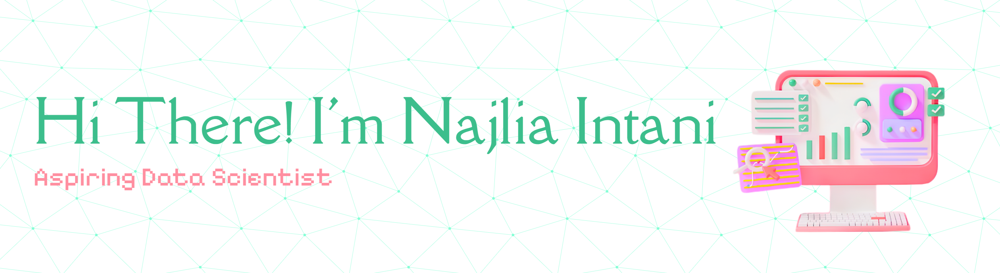
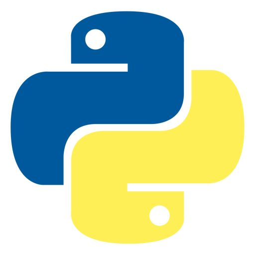
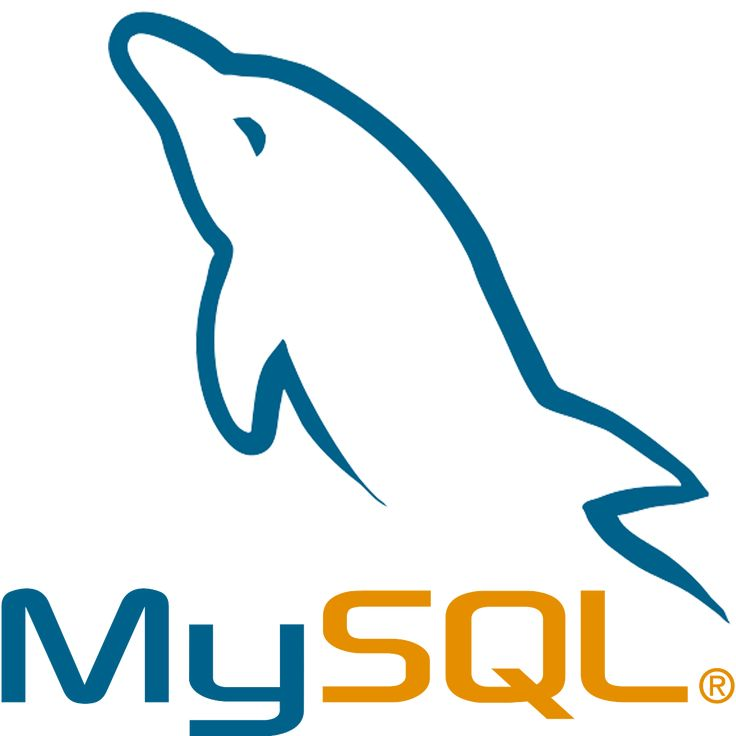
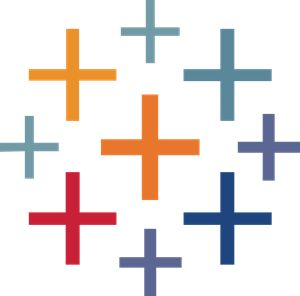

An undergraduate Data Science student, passionate about turning data into insights and data-driven decisions. Hands-on experience in data analysis, teaching lab assistant and active in organizations. Always eager to learn and contribute through collaborations, real-world data projects, and internships.

<h6>Tech Stack</h6>

  
  
  
  
  
  

<h6>Connect With Me</h6>

  

  

